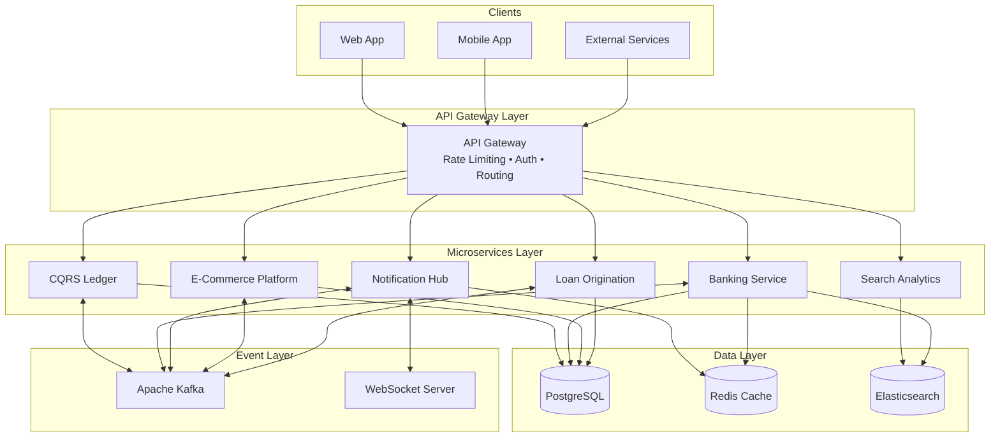
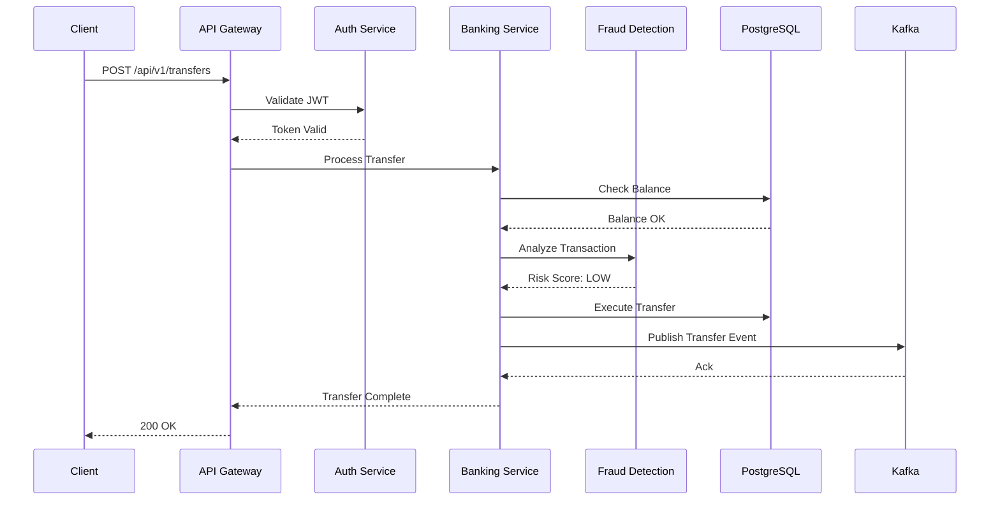
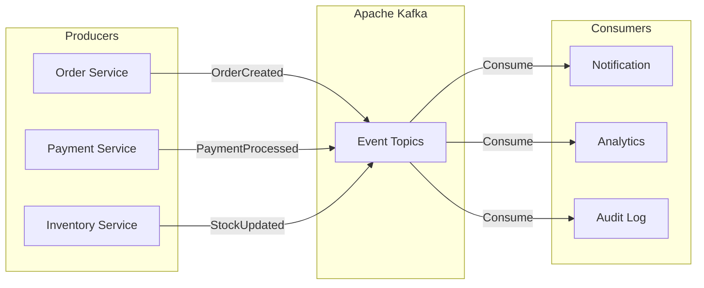
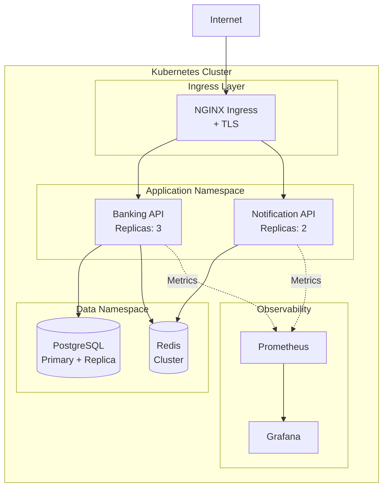

# Juan Zavala

**Senior Java Developer** · Spring Boot · Microservices · Cloud-Native APIs

---

## 👋 About Me

Backend engineer with 15+ years of expertise in Java and the Spring ecosystem. I specialize in building production-grade REST APIs, event-driven systems, and cloud-native microservices. Passionate about clean architecture, domain-driven design, and engineering excellence.

---

## 🛠️ Tech Stack

| Category | Technologies |
|----------|-------------|
| **Languages** | Java 17/21, SQL, JavaScript |
| **Frameworks** | Spring Boot 3.x, Spring Security, Spring Data, Spring WebFlux |
| **Data** | PostgreSQL, Redis, Elasticsearch, Flyway |
| **Messaging** | Apache Kafka, RabbitMQ, WebSocket (STOMP) |
| **DevOps** | Docker, Kubernetes, GitHub Actions, Maven |
| **Patterns** | DDD, CQRS, Event Sourcing, Saga, Hexagonal Architecture, Multi-tenancy |
| **Observability** | Prometheus, Grafana, ELK Stack, OpenTelemetry |

---

## 🏗️ Architecture Philosophy

---

## 📊 Featured Projects

| Project | Description | Tech Highlights |
|---------|-------------|-----------------|
| [cqrs-event-sourcing-ledger](https://github.com/jzavalaq/cqrs-event-sourcing-ledger) | Banking ledger implementing **CQRS and Event Sourcing** patterns with Axon Framework, event replay, and complete audit trail | **Axon Framework**, CQRS, Event Sourcing, DDD |
| [search-analytics-elasticsearch-api](https://github.com/jzavalaq/search-analytics-elasticsearch-api) | Full-text search and analytics API with **Elasticsearch 8.x** integration, fuzzy matching, and search analytics | **Elasticsearch 8.x**, Full-Text Search, Redis |
| [banking-financial-api](https://github.com/jzavalaq/banking-financial-api) | Complete banking system with multi-currency accounts, SWIFT/SEPA transfers, fraud detection, loans, and KYC compliance | Spring Boot 3.2, JWT, PostgreSQL, Flyway, K8s |
| [notification-hub-api](https://github.com/jzavalaq/notification-hub-api) | Multi-channel notification platform supporting email, SMS, push notifications with Redis caching and **WebSocket real-time** | Spring Boot, Redis, WebFlux, **WebSocket/STOMP** |
| [api-rate-limiting-gateway](https://github.com/jzavalaq/api-rate-limiting-gateway) | Reactive API gateway with token bucket rate limiting algorithm | **Spring WebFlux**, Bucket4j, Resilience4j |
| [multitenant-ecommerce-api](https://github.com/jzavalaq/multitenant-ecommerce-api) | Multi-tenant e-commerce platform with vendor isolation, product management, and shopping cart | Spring Boot, **Multi-tenancy**, JWT, RBAC |
| [loan-origination-credit-api](https://github.com/jzavalaq/loan-origination-credit-api) | Fintech loan origination system with FICO-style credit scoring engine and automated decision workflow | Spring Boot, Credit Scoring, Audit Logging |

---

## 🔄 System Design Example

### Banking Transaction Flow

### Event-Driven Architecture

---

## ☁️ Cloud-Native Deployment

---

## 📈 GitHub Stats

---

## 🔗 Connect

---

> "Building robust, scalable backend systems with clean architecture and enterprise best practices."
